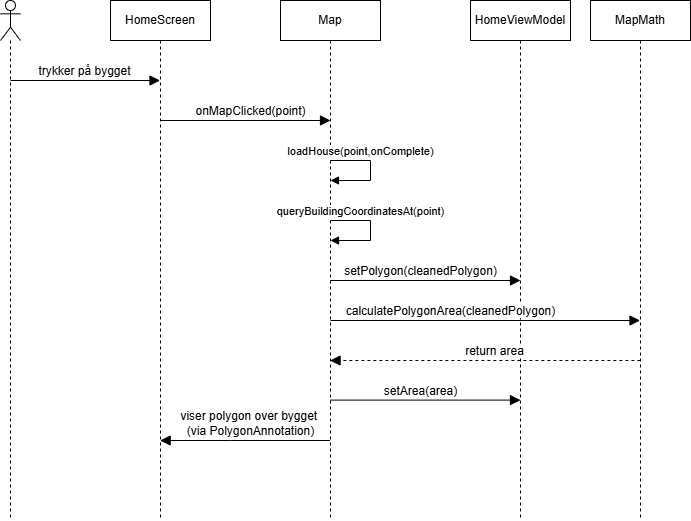
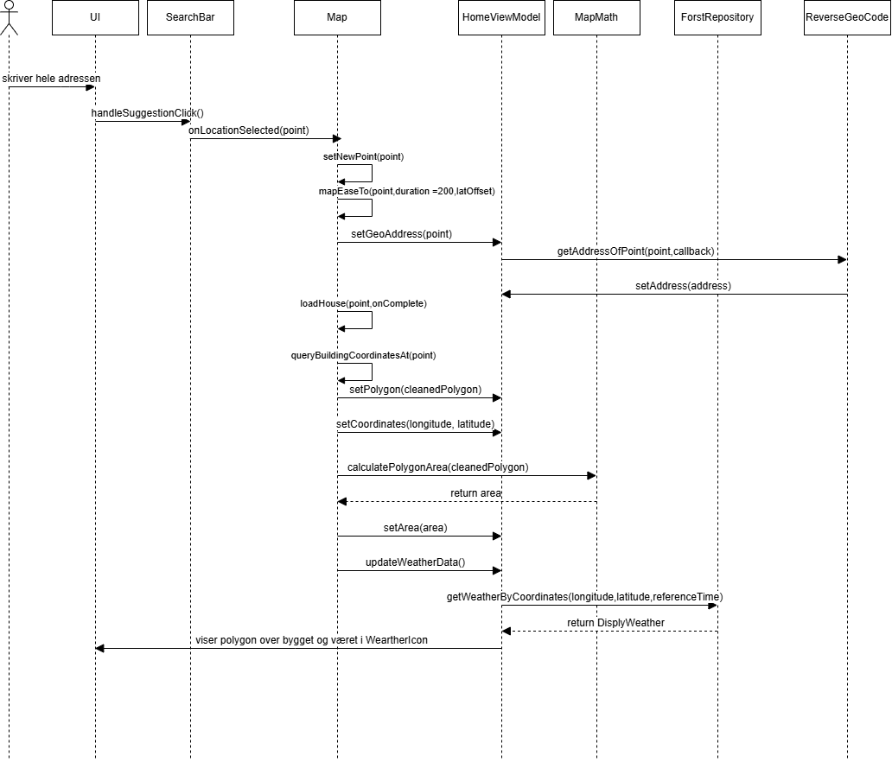
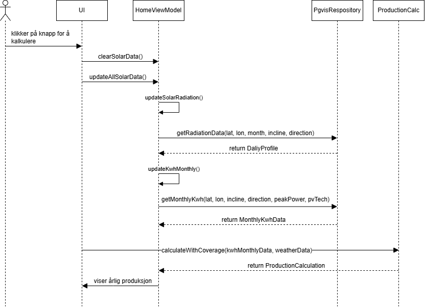

Modellering

Vi valgte følgende diagrammer for å modellere applikasjonen:
Use Case Diagram: Gir en oversikt over de viktigste brukerscenariene og aktørene for å kommunisere funksjonalitet til interessenter.
Sekvensdiagrammer: Viser detaljert interaksjon mellom komponenter over tid for de viktigste use casene.
Aktivitetsdiagram: Viser prosessflyten for en use case.

Use case:

Navn: Interaksjon med solcelleberegningsapplikasjon
Primæraktør: Bruker
Sekundæraktør:Server (som håndterer API-kall)
 
Beskrivelse:
Denne applikasjonen lar brukeren utforske mulighetene for solcelleinstallasjon på en spesifikk bygning.
Brukeren kan søke etter en adresse, velge en bygning på kartet, konfigurere et tenkt solcelleanlegg, 
beregne forventet produksjon ved hjelp av data fra eksterne API-er, lagre og administrere prosjekter,
se værdata for området, få anbefalt utstyr og lese en FAQ/guide for hjelp.
 
Pre-betingelser:
Applikasjonen er åpen. Visse funksjoner krever aktiv internettilkobling.
Kart kan være tilgjengelig lokalt for visning uten internett.
 
Post-betingelser:
Relevant informasjon/resultat vises for ønsket bygg, utført en beregning av solcelleproduksjon,
se været, administrert lagrede prosjekter (lagret, slettet), og fått tilgang til hjelpeinformasjon.
 
Hovedflyt:
1.Brukeren søker etter en spesifikk adresse.
2.Systemet viser adressen på kartet.
3.Brukeren trykker på bygget.
4.Brukeren kan lagre prosjektet fra nå av.
5.Systemet viser polygon til det valgte bygget.
6.Brukeren kan se værdata for området.
7.Brukeren setter opp solcellepanelkonfigurasjon(vinkel,retning,type solcellepanell).
8.Brukeren klikker på knapp for å kalkulere årlig produksjon.
9.Systemet henter data fra Pgvis API og fra Frost API.
10.Systemet beregner forventet årlig produksjon og viser resultat.
11.Brukeren kan se liste over de tidligere lagrede prosjekter.
12.Brukeren kan slette et lagret prosjekt.
13.Brukeren kan se anbefalte produkter og bli navigert til nettleser.
14.Brukeren kan åpne FAQ/Guide.
 
Alternativ flyt:
0.1 Appen er åpen, men det er ingen internettforbindelse.
0.2 Systemet viser en melding til brukeren: "Ingen internett-tilkobling"
0.3 Brukeren kan kun benytte offline-funksjoner
0.3.1 Brukeren kan fortsetter fra steg 11 , hvis brukeren hadde lagret prosjekt fra før
0.3.2 Brukeren kan fortsetter fra steg 13 , hvis brukeren hadde ikke lagret prosjekt fra før
7.1 Brukeren hopper over konfigurasjon og bruker en standard forhåndsdefinert solcellekonfigurasjon.
7.2 Brukeren kan fortsetter fra steg 8

Sekvensdiagram:

Use Case 1: Søk etter adresse

Beskrivelse: Brukeren søker etter en spesifikk adresse for å finne et bygg å analysere for solcelleinstallasjon.
Systemet viser adressen på et kart.
Pre-betingelser:Applikasjonen er åpen og har internettilkobling.
Post-betingelser:Adressen vises på kartet i applikasjonen.
Hovedflyt:
1.Brukeren skriver inn en adresse i søkefeltet.
2.Systemet behandler søket og finner koordinatene til adressen.
3.Systemet oppdaterer kartet og viser adressen.

Use Case 2: Velg bygg og vis polygon

Beskrivelse: Brukeren velger et bygg ved å trykke på kartet, og systemet viser et polygon over bygget.
Pre-betingelser: Kartet er lastet inn og viser en adresse.
Post-betingelser: Et polygon vises over det valgte bygget, og arealet er beregnet.
Hovedflyt:
1.Brukeren trykker på et bygg på kartet.
2.Systemet henter koordinater og bygningsdata for det valgte punktet.
3.Systemet viser et polygon over bygget og beregner arealet.

Use Case 3:SøkeMedHeleAdressen

Beskrivelse: Brukeren søker med en fullstendig adresse, og systemet henter adresse-og værdata for området.
Pre-betingelser: Applikasjonen er åpen og har internettilkobling.
Post-betingelser: Adresse og værdata vises i applikasjonen.
Hovedflyt:
1.Brukeren skriver inn en fullstendig adresse i søkefeltet.
2.Systemet behandler adressen og henter tilhørende koordinater.
3.Systemet henter værdata for området og viser resultatet.

Use Case 4: Kalkuler og vis årlig produksjon

Beskrivelse: Brukeren beregner forventet årlig produksjon for et solcelleanlegg basert på valgt bygg 
og konfigurasjon.
Pre-betingelser: Et bygg er valgt, og solcellekonfigurasjon er satt opp (eller standardkonfigurasjon brukes).
Post-betingelser: Årlig produksjon vises i applikasjonen.
Hovedflyt:
1.Brukeren klikker på en knapp for å starte beregningen.
2.Systemet henter sol- og kWh-data fra eksterne API-er.
3.Systemet beregner forventet årlig produksjon basert på tilgjengelige data.
4.Systemet viser den årlige produksjonen i grensesnittet.

Aktivitetsdiagram:

Beskrivelse: Viser prosessflyten for brukeren fra søk til visning av resultater.
