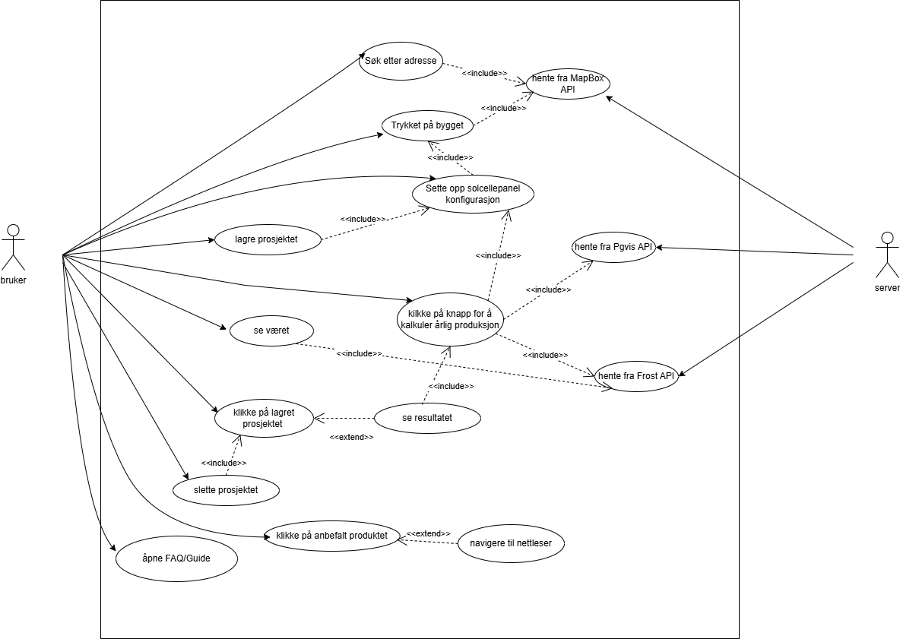
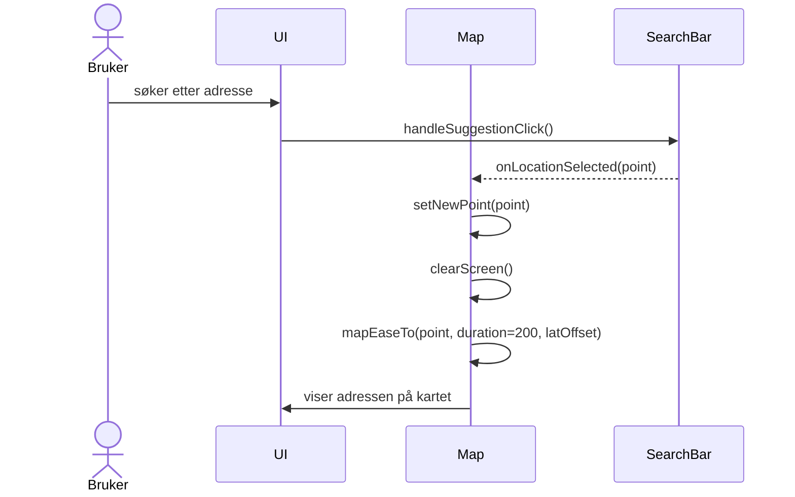
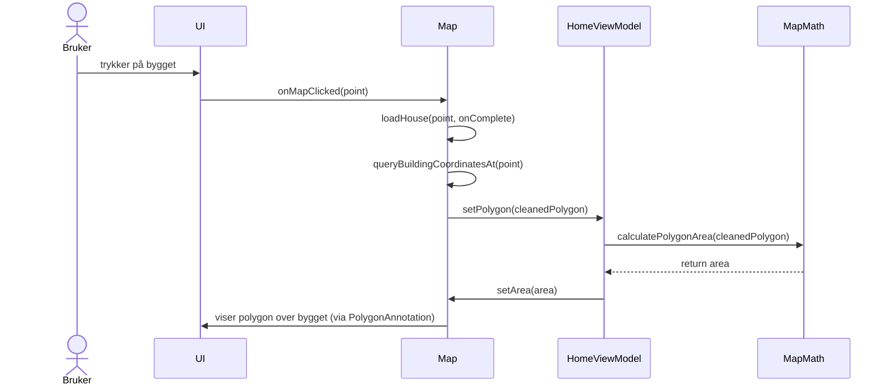
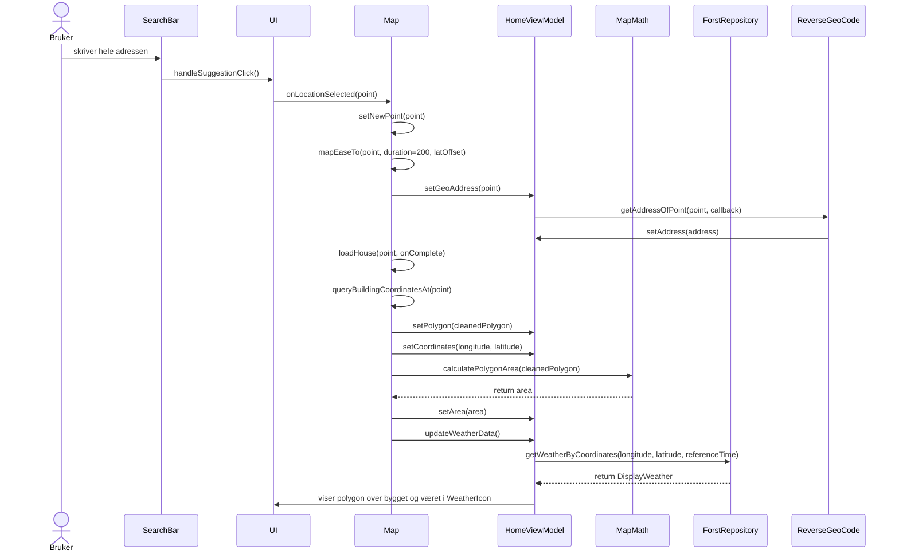
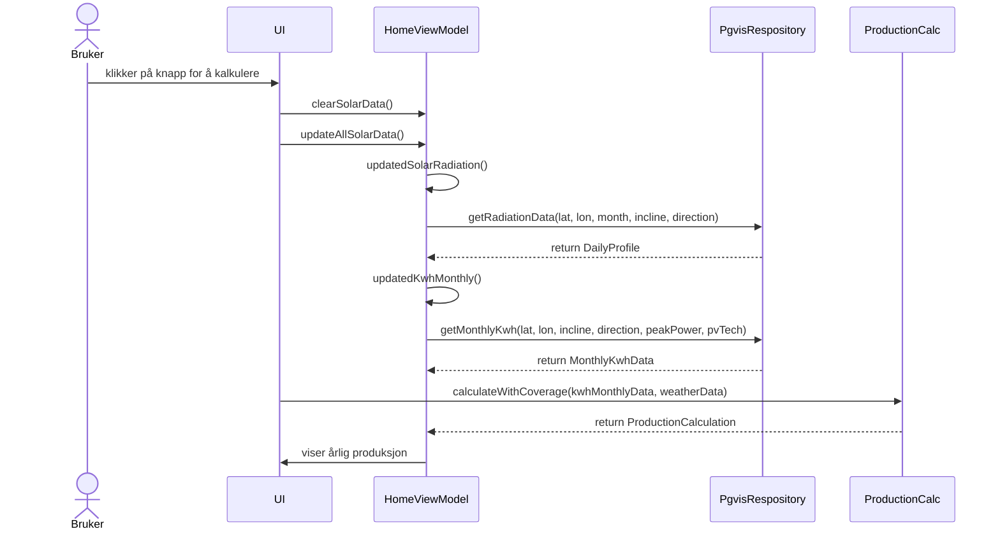
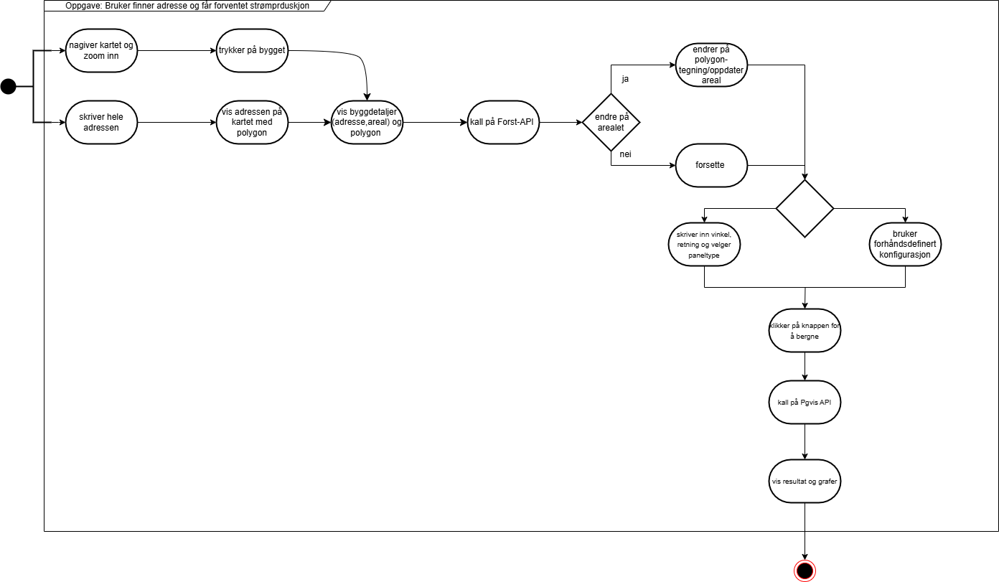

# Modellering

Vi valgte følgende diagrammer for å modellere applikasjonen:

- **Use Case Diagram**: Gir en oversikt over de viktigste brukerscenariene og aktørene for å kommunisere funksjonalitet til interessenter.  
- **Sekvensdiagrammer**: Viser detaljert interaksjon mellom komponenter over tid for de viktigste use casene.  
- **Aktivitetsdiagram**: Viser prosessflyten for en use case.

---

## Use Case

**Navn**: Interaksjon med solcelleberegningsapplikasjon  
**Primæraktør**: Bruker  
**Sekundæraktør**: Server (som håndterer API-kall)

### Beskrivelse

Denne applikasjonen lar brukeren utforske mulighetene for solcelleinstallasjon på en spesifikk bygning.  
Brukeren kan:

- Søke etter en adresse  
- Velge en bygning på kartet  
- Konfigurere et tenkt solcelleanlegg  
- Beregne forventet produksjon ved hjelp av data fra eksterne API-er  
- Lagring og administrasjon av prosjekter  
- Se værdata for området  
- Få anbefalt utstyr  
- Lese FAQ/guide for hjelp  

### Pre-betingelser

- Applikasjonen er åpen  
- Visse funksjoner krever aktiv internettilkobling  
- Kart kan være tilgjengelig lokalt uten internett

### Post-betingelser

- Relevant informasjon vises for valgt bygg  
- Beregning av solcelleproduksjon er utført  
- Værdata er tilgjengelig  
- Prosjekter er administrert (lagret/slettet)  
- Hjelpeinformasjon er tilgjengelig

### Hovedflyt

1. Brukeren søker etter en spesifikk adresse  
2. Systemet viser adressen på kartet  
3. Brukeren trykker på bygget  
4. Brukeren kan lagre prosjektet  
5. Systemet viser polygon til bygget  
6. Brukeren kan se værdata  
7. Brukeren setter opp solcellepanel-konfigurasjon (vinkel, retning, type)  
8. Brukeren klikker for å kalkulere produksjon  
9. Systemet henter data fra Pgvis API og Frost API  
10. Systemet beregner og viser resultat  
11. Brukeren ser liste over lagrede prosjekter  
12. Brukeren kan slette et prosjekt  
13. Brukeren kan se anbefalte produkter og åpne nettleser  
14. Brukeren kan åpne FAQ/Guide

### Alternativ flyt

- **0.1** Appen er åpen uten internett  
- **0.2** Systemet viser melding: "Ingen internett-tilkobling"  
- **0.3** Brukeren kan kun bruke offline-funksjoner  
  - **0.3.1** Fortsetter fra steg 11 (hvis prosjekt er lagret)  
  - **0.3.2** Fortsetter fra steg 13 (hvis ikke lagret prosjekt)  
- **7.1** Brukeren hopper over konfigurasjon og bruker standardoppsett  
- **7.2** Fortsetter fra steg 8  

---

## Sekvensdiagrammer

### Use Case 1: Søk etter adresse

**Beskrivelse**: Brukeren søker etter en adresse. Systemet viser den på kartet.  
**Pre-betingelser**: Applikasjonen er åpen med internettilkobling  
**Post-betingelser**: Adressen vises på kartet  

**Flyt**:
1. Brukeren skriver inn adresse  
2. Systemet henter koordinater  
3. Kartet oppdateres

---

### Use Case 2: Velg bygg og vis polygon

**Beskrivelse**: Brukeren trykker på bygg på kartet. Systemet viser polygon.  
**Pre-betingelser**: Kart er lastet inn  
**Post-betingelser**: Polygon vises og areal beregnes  

**Flyt**:
1. Brukeren trykker på bygg  
2. Systemet henter data  
3. Systemet viser polygon og beregner areal

---

### Use Case 3: Søke med hele adressen

**Beskrivelse**: Full adresse gir både posisjon og værdata  
**Pre-betingelser**: Applikasjonen har internettilkobling  
**Post-betingelser**: Adresse og værdata vises  

**Flyt**:
1. Brukeren skriver inn full adresse  
2. Systemet henter koordinater  
3. Systemet henter værdata

---

### Use Case 4: Kalkuler og vis årlig produksjon

**Beskrivelse**: Brukeren beregner produksjon for valgt bygg og konfigurasjon  
**Pre-betingelser**: Bygg er valgt og konfigurasjon er satt  
**Post-betingelser**: Årlig produksjon vises  

**Flyt**:
1. Brukeren starter beregning  
2. Systemet henter API-data  
3. Systemet kalkulerer produksjon  
4. Resultat vises

---

## Aktivitetsdiagram

**Beskrivelse**: Viser prosessflyt fra søk til visning av resultater i applikasjonen.
